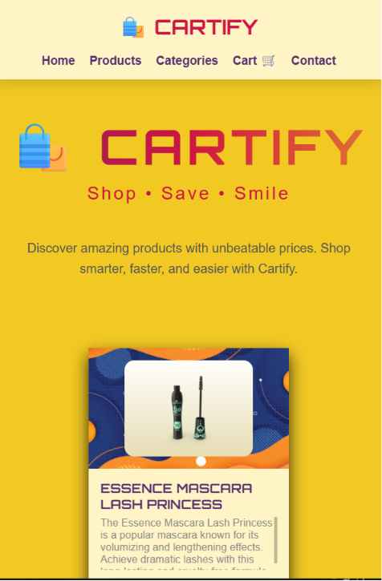

# 🛍️ Cartify

> **Shop • Save • Smile**

Cartify is a responsive and modern e-commerce product listing application built using **HTML, CSS, and JavaScript**. It fetches product data from the **DummyJSON API** and dynamically generates attractive product cards with quantity controls and interactive animations.

---

## 🚀 Features

- 📦 Fetches products from DummyJSON API
- 🎨 Beautiful product card UI
- 🖼️ Dynamic background images for each card
- ➕ Increase product quantity
- ➖ Decrease product quantity
- 💰 Live price calculation based on quantity
- ✨ Animated quantity and price updates
- 🛒 Add to Cart button
- 📱 Responsive card layout using Flexbox
- 🌈 Modern hero section with animations
- 🎯 Hover effects and smooth transitions

---

## 🛠️ Built With

- HTML5
- CSS3
- JavaScript (ES6)
- Fetch API
- DummyJSON API

---

## 📂 Project Structure

```
Cartify/
│── index.html
│── styles.css
│── script.js
│── img-bg.jpg
│── bg1.png
│── bg2.png
│── bg3.png
│── bg4.png
│── bg5.png
└── README.md
```

---

## 📸 Preview

The application includes:

- Hero Section
- Responsive Navbar
- Dynamic Product Cards
- Quantity Selector
- Live Price Updates
- Attractive Product Backgrounds

---

## 🌐 API Used

DummyJSON Products API

```
https://dummyjson.com/products
```

---

## ⚙️ How to Run

1. Clone the repository

```bash
git clone https://github.com/yourusername/cartify.git
```

2. Open the project folder.

3. Run using VS Code Live Server

or

Simply open `index.html` in your browser.

---

## 🎯 Future Improvements

- ❤️ Wishlist
- 🔍 Search Products
- 📂 Category Filter
- ⭐ Product Rating
- 🛒 Shopping Cart Page
- 💳 Checkout Page
- 🌙 Dark Mode
- 👤 User Authentication
- 📱 Better Mobile Responsiveness

---

## 📷 Screenshots
### Home Page


### Products


### Mobile View


---

## 👨‍💻 Author

**Arif A**

GitHub: https://github.com/arifaslam2002

---

## ⭐ Support

If you like this project, consider giving it a ⭐ on GitHub.

---

## 📄 License

This project is open-source and available under the MIT License.